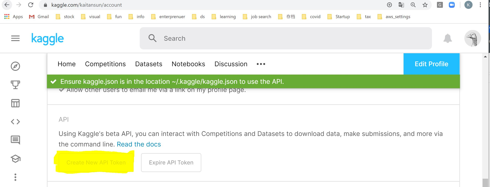

# Kaggle API to Download Data

### Dataset (`Copy API Commond` from kaggle)
`kaggle datasets download -d allen-institute-for-ai/CORD-19-research-challenge`

### Intro
1. Install package
`pip install kaggle`

2. Get API token (json file) from kaggle website

3. Move the file to right Place
- Linux, OSX: `~/.kaggle/kaggle.json`
- Windows: `C:\Users<Windows-username>.kaggle\kaggle.json`

4. Ready to run codes
Common codes:
- `kaggle competitions list`: list the currently active competitions
- `kaggle competitions download -c [COMPETITION]`: download files associated with a competition
- `kaggle competitions submit -c [COMPETITION] -f [FILE] -m [MESSAGE]`: make a competition submission

### Ref
Refer to [official instructions](https://www.kaggle.com/docs/api).
